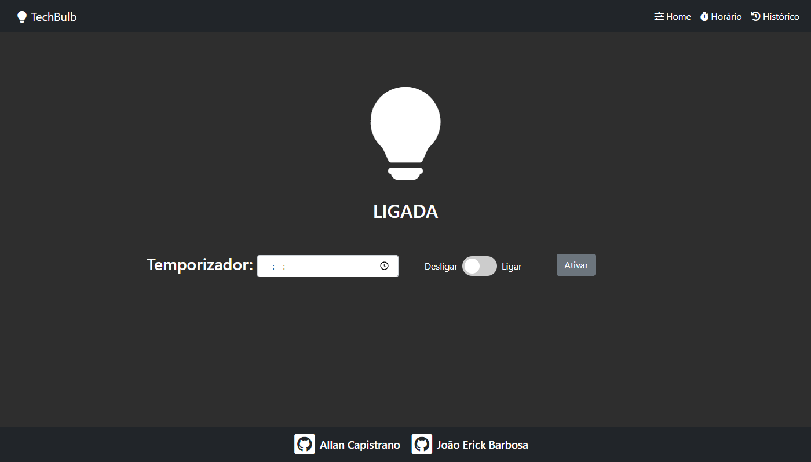

# TechBulb

<h3 align="center">Página Inicial - TechBulb</h3>

  

------------

## 🖥️ Manuais ##

- [Manual de Usuário](https://github.com/AllanCapistrano/SD-PBL2-Web/blob/main/manuals/user-manual.md)
- [Manual de Sistema](https://github.com/AllanCapistrano/SD-PBL2-Web/blob/main/manuals/system-manual.md)

------------

## 📚 Descrição ##
Aplicação Web destinada à resolução do problema dois do MI - Sistemas Digistais (TEC 499).

O objetivo desta, é realizar a manipulação de uma lâmpada com o auxílio do módulo NodeMCU 8266 utizando o protocolo de comunicação MQTT.

[Código da placa](https://github.com/JoaoErick/SD-PBL2-ESP8266)

**🔗 Tecnologias utilizadas:**
- [Laravel](https://laravel.com/)
- [AWS Elastic BeanStalk](https://aws.amazon.com/pt/elasticbeanstalk/)
- [AWS IoT Core](https://aws.amazon.com/pt/iot-core/)
- [AWS RDS](https://aws.amazon.com/pt/rds/)
- [AWS Lambda](https://aws.amazon.com/pt/lambda/)

**📊 Dependências:**
- [Bootstrap 5.0](https://getbootstrap.com/)
- [Font Awesome](https://fontawesome.com/)
- [Laravel LiveWire](https://laravel-livewire.com/)
- [Laravel  Client (MQTT)](https://github.com/php-mqtt/laravel-client)
- [PyMySQL](https://github.com/PyMySQL/PyMySQL)

------------

## 📌 Autores ##
- Allan Capistrano: [Github](https://github.com/AllanCapistrano) - [Linkedin](https://www.linkedin.com/in/allancapistrano/) - [E-mail](https://mail.google.com/mail/u/0/?view=cm&fs=1&tf=1&source=mailto&to=asantos@ecomp.uefs.br)

- João Erick: [Github](https://github.com/JoaoErick) - [Linkedin](https://www.linkedin.com/in/joão-erick-barbosa-9050801b0/) - [E-mail](https://mail.google.com/mail/u/0/?view=cm&fs=1&tf=1&source=mailto&to=jsilva@ecomp.uefs.br)
------------

## ⚖️ Licença ##
[MIT License (MIT)](https://github.com/AllanCapistrano/SD-PBL2-Web/blob/main/LICENSE)
